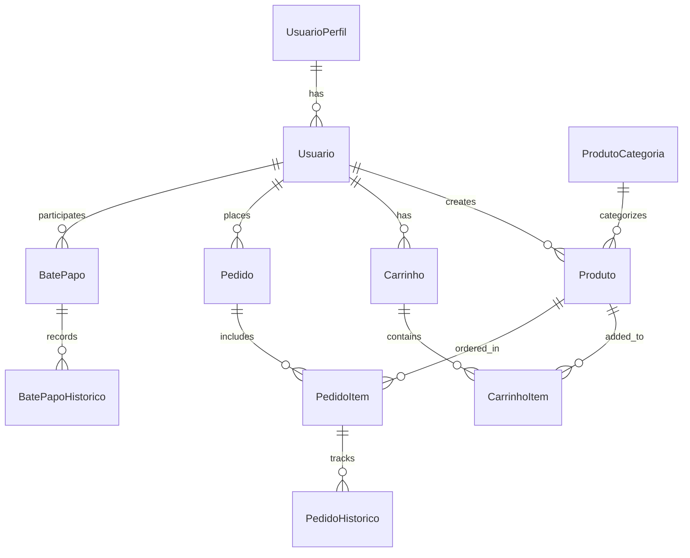

# 🛍️ Ecomerce-Simplificado

A simple yet powerful e-commerce platform built with NestJS (backend) and Next.js (frontend).

<p align="center">
  
  
  
  
  
</p>

---

*Read this in other languages: [English](#english), [Português](#português)*

---

<a id="english"></a>
## 📝 English

### 📋 Project Overview

Ecomerce-Simplificado is a full-stack e-commerce solution with comprehensive features for product management, user authentication, shopping cart functionality, and order processing.

### 🏗️ Architecture

The project uses a modern stack:

- **Backend**: NestJS with TypeORM and PostgreSQL
- **Frontend**: Next.js with React 19, Tailwind CSS, and Turbopack
- **Infrastructure**: Docker and Docker Compose for containerization

### 🚀 Getting Started

#### Prerequisites

- [Node.js](https://nodejs.org/) (v18+)
- [Docker](https://www.docker.com/) and Docker Compose
- [Git](https://git-scm.com/)

#### Initial Setup

1. **Clone the repository**

```bash
git clone https://github.com/yourusername/ecomerce-simplificado.git
cd ecomerce-simplificado
```

2. **Set up environment variables**

```bash
# Copy the example env file and modify as needed
cp Backend/ecomerce-simplificado/.env.example Backend/ecomerce-simplificado/.env
```

Example configurations for your `.env` file:

```
DB_HOST=localhost
DB_DOCKER_HOST=postgres
DB_PORT=5432
DB_USERNAME=postgres
DB_PASSWORD=yourpassword
DB_NAME=Ecomerce-Simplificado
POSTGRES_CONTAINER_NAME=ecomerce-simplificado
APP_PORT=3001
```

### 🐳 Running with Docker

Start the entire application stack with a single command:

```bash
docker-compose up --build
```

This will:
- Build and start the PostgreSQL database
- Set up pgAdmin for database management (available at http://localhost:5050)
- Build and start the NestJS backend
- Build and start the Next.js frontend

To stop and remove containers:

```bash
docker-compose down -v
```

### 💻 Manual Development Setup

#### Backend (NestJS)

```bash
cd Backend/ecomerce-simplificado
npm install
npm run start:dev
```

The API will be available at `http://localhost:3001`

#### Frontend (Next.js)

```bash
cd Frontend/ecomerce-simplificado
npm install
npm run dev
```

The application will be available at `http://localhost:3000`

### 🗄️ Database

To connect to the PostgreSQL database using the CLI:

```bash
docker exec -it ecomerce-simplificado psql -U postgres -d Ecomerce-Simplificado
```

Useful PostgreSQL commands:

```sql
-- Connect to database
\c Ecomerce-Simplificado

-- List all tables
SELECT table_name FROM information_schema.tables WHERE table_schema = 'public';

-- Check if database is working
SELECT now();
```

You can also access pgAdmin at `http://localhost:5050` with:
- Email: admin@example.com
- Password: admin

### 📦 Project Structure

```
ecomerce-simplificado/
├── Backend/
│   └── ecomerce-simplificado/
│       ├── src/
│       │   ├── entity/         # Database entities
│       │   ├── model/          # Data models
│       │   └── main.ts         # Application entry point
│       ├── Dockerfile          # Backend container configuration
│       └── docker-compose.yml  # Container orchestration
├── Frontend/
│   └── ecomerce-simplificado/
│       ├── app/                # Next.js pages and components
│       ├── public/             # Static assets
│       └── package.json        # Frontend dependencies
└── README.md                   # This file
```

---

<a id="português"></a>
## 📝 Português

### 📋 Visão Geral do Projeto

Ecomerce-Simplificado é uma solução de e-commerce full-stack com recursos abrangentes para gerenciamento de produtos, autenticação de usuários, funcionalidade de carrinho de compras e processamento de pedidos.

### 🏗️ Arquitetura

O projeto utiliza uma stack moderna:

- **Backend**: NestJS com TypeORM e PostgreSQL
- **Frontend**: Next.js com React 19, Tailwind CSS e Turbopack
- **Infraestrutura**: Docker e Docker Compose para containerização

### 🚀 Começando

#### Pré-requisitos

- [Node.js](https://nodejs.org/) (v18+)
- [Docker](https://www.docker.com/) e Docker Compose
- [Git](https://git-scm.com/)

#### Configuração Inicial

1. **Clone o repositório**

```bash
git clone https://github.com/seuusuario/ecomerce-simplificado.git
cd ecomerce-simplificado
```

2. **Configure as variáveis de ambiente**

```bash
# Copie o arquivo de exemplo e modifique conforme necessário
cp Backend/ecomerce-simplificado/.env.example Backend/ecomerce-simplificado/.env
```

Exemplo de configurações para seu arquivo `.env`:

```
DB_HOST=localhost
DB_DOCKER_HOST=postgres
DB_PORT=5432
DB_USERNAME=postgres
DB_PASSWORD=suasenha
DB_NAME=Ecomerce-Simplificado
POSTGRES_CONTAINER_NAME=ecomerce-simplificado
APP_PORT=3001
```

### 🐳 Executando com Docker

Inicie toda a pilha de aplicativos com um único comando:

```bash
docker-compose up --build
```

Isso irá:
- Construir e iniciar o banco de dados PostgreSQL
- Configurar o pgAdmin para gerenciamento de banco de dados (disponível em http://localhost:5050)
- Construir e iniciar o backend NestJS
- Construir e iniciar o frontend Next.js

Para parar e remover os contêineres:

```bash
docker-compose down -v
```

### 💻 Configuração Manual para Desenvolvimento

#### Backend (NestJS)

```bash
cd Backend/ecomerce-simplificado
npm install
npm run start:dev
```

A API estará disponível em `http://localhost:3001`

#### Frontend (Next.js)

```bash
cd Frontend/ecomerce-simplificado
npm install
npm run dev
```

A aplicação estará disponível em `http://localhost:3000`

### 🗄️ Banco de Dados

Para conectar ao banco de dados PostgreSQL usando a CLI:

```bash
docker exec -it ecomerce-simplificado psql -U postgres -d Ecomerce-Simplificado
```

Comandos úteis do PostgreSQL:

```sql
-- Conectar ao banco de dados
\c Ecomerce-Simplificado

-- Listar todas as tabelas
SELECT table_name FROM information_schema.tables WHERE table_schema = 'public';

-- Verificar se o banco de dados está funcionando
SELECT now();
```

Você também pode acessar o pgAdmin em `http://localhost:5050` com:
- Email: admin@example.com
- Senha: admin

### 📦 Estrutura do Projeto

```
ecomerce-simplificado/
├── Backend/
│   └── ecomerce-simplificado/
│       ├── src/
│       │   ├── entity/         # Entidades de banco de dados
│       │   ├── model/          # Modelos de dados
│       │   └── main.ts         # Ponto de entrada da aplicação
│       ├── Dockerfile          # Configuração do contêiner backend
│       └── docker-compose.yml  # Orquestração de contêineres
├── Frontend/
│   └── ecomerce-simplificado/
│       ├── app/                # Páginas e componentes Next.js
│       ├── public/             # Ativos estáticos
│       └── package.json        # Dependências do frontend
└── README.md                   # Este arquivo
```

---

## 📄 License

This project is licensed under the MIT License - see the LICENSE file for details.

## 📊 Entity Relationship Diagram



# Old readme, it isnt finished yet!

# Next
## Install dependencies
npx create-next-app@latest ecommerce-frontend --ts
npm i --save -D tailwindcss postcss autoprefixer
## Install React Query
npm i --save @tanstack/react-query 
## Install React Hook Form and Zod
npm i --save react-hook-form zod @hookform/resolvers
## Install NextAuth.js
npm i --save next-auth
## Install Axios
npm i --save axios
## Install Lucide
npm i --save lucide-react
## 
npm i --save  -D @tailwindcss/forms @tailwindcss/typography @tailwindcss/aspect-ratio
npm i --save -D tailwindcss@latest postcss@latest autoprefixer@latest
npm i --save -D tailwindcss autoprefixer postcss
npm i --save  -D tailwindcss@latest postcss@latest autoprefixer@latest
npm i --save tailwindcss@3 autoprefixer postcss

## Start the dev server
npm run dev

## Configure Tailwind CSS (tailwind.config.js)
module.exports = {
  content: [
    "./pages/**/*.{js,ts,jsx,tsx}",
    "./components/**/*.{js,ts,jsx,tsx}",
  ],
  theme: {
    extend: {},
  },
  plugins: [],
};

# Nest
npm i
npm i -g @nestjs/cli
npm i --save @nestjs/platform-fastify    
npm i --save @nestjs/typeorm typeorm pg   
npm i --save @nestjs/config

## Need before starting
Invoke-WebRequest https://raw.githubusercontent.com/vishnubob/wait-for-it/master/wait-for-it.sh -OutFile wait-for-it.sh


# Docker

## Set the initial container. Variables need to be the same in .env archive use .env.example
docker run --name [container-name] -e POSTGRES_USER=[user-name] -e POSTGRES_PASSWORD=[your-password] -e POSTGRES_DB=[database-name] -p 5432:5432 -d postgres

## Build the postgres container
docker exec -it postgres_container apt-get update
docker exec -it postgres_container apt-get install -y postgresql-client

## Check the database container and test tables
docker exec -it ecomerce-simplificado psql -U postgres -d Ecomerce-Simplificado
\c Ecomerce-Simplificado
SELECT current_schema(); or  SELECT table_name FROM information_schema.tables WHERE table_schema = 'public';


## Test if it's ok!
SELECT now();

# To run application
docker-compose down -v  # Stop and remove volumes
docker-compose up --build  # Rebuild and restart everything